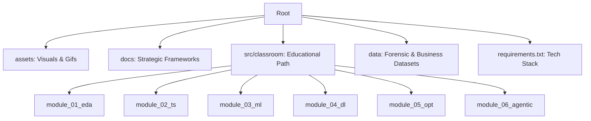

# 📊 Data Science for Business Models
> **Applied Statistics, Machine Learning & Agentic AI for Strategic Decision Making**

Bienvenido a este repositorio pedagógico y profesional. Aquí no solo escribimos código: construimos puentes entre el rigor analítico y el impacto real en los negocios. Este espacio está diseñado para entender cómo los datos estructuran la realidad de una organización y cómo los algoritmos pueden optimizar la toma de decisiones.

---

## 🎯 The Vision: From Prediction to Action

Este repositorio no busca solo "entrenar modelos", sino resolver la ecuación económica de la IA:

| Pilar | Concepto Clave | Autor de Referencia |
| :--- | :--- | :--- |
| **Economía de la IA** | La IA reduce el costo de predicción; el valor sube en el **Juicio**. | *Agrawal (Prediction Machines)* |
| **Valor Esperado** | Decisiones basadas en $P(x) \cdot Value(x)$ (Matrices de Confusión Económicas). | *Provost (DS for Business)* |
| **Causalidad** | Diferenciar correlación de causalidad para intervenciones reales. | *Matt Taddy (Business DS)* |
| **Agencia** | El paso del software pasivo a agentes que ejecutan flujos de valor. | *Socio-Economic AI Models* |

---

## 🗺️ Syllabus Detallado e Integrado

Haz clic en los botones de cada módulo para acceder al material teórico, notebooks y ejercicios prácticos.

### 🛠️ Core Engineering (M1 - M3)

* **Técnica:** ETL, Limpieza, Outliers, Feature Scaling.
* **Aplicación en Negocios:** Asegurar la integridad del reporte forense/empresarial y diagnóstico inicial.

* **Técnica:** Estacionalidad, APIs Financieras, Suavizado.
* **Aplicación en Negocios:** Predicción de ingresos y planificación de inventarios.

* **Técnica:** XGBoost, Random Forest, Regresión Logística.
* **Aplicación en Negocios:** Lead Scoring, Churn Prevention y Credit Scoring.

### 🚀 Advanced Strategy (M4 - M6)

* **Técnica:** Backpropagation, CNNs, MLP.
* **Aplicación en Negocios:** Reconocimiento de patrones en alta dimensionalidad.

* **Técnica:** Programación Lineal, Simplex, Dualidad.
* **Aplicación en Negocios:** Maximización de márgenes bajo restricciones de recursos.

* **Técnica:** Reasoning Loops, Tool-use, Autonomous Agents.
* **Aplicación en Negocios:** Creación de flujos de trabajo que operan sin intervención humana.

---

## 🧱 Repository Structure

---

## 🛠️ Tech Stack & Requirements

  
  
  
  
  

* **Nivel:** Intermedio - Avanzado.
* **Entorno:** VS Code + Jupyter / Google Colab.
* **Dependencias:** Ejecutar `pip install -r requirements.txt` para configurar el entorno estratégico.

---

## 🤝 Contribuciones y Contacto

Este espacio es una bitácora profesional y pedagógica. Si eres alumno o colega, te invito a explorar los notebooks interactivos y el material documentado.
---

## 🤝 Contribuciones y Contacto

Este espacio es una bitácora profesional y pedagógica. Si eres alumno o colega, te invito a explorar los notebooks interactivos.

