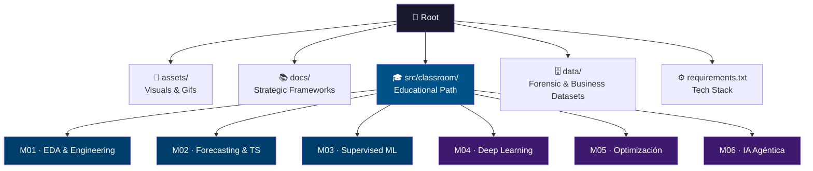

<p align="center">
  
</p>

# 📊 Data Science for Business Models
> **Applied Statistics, Machine Learning & Agentic AI for Strategic Decision Making**
# 📊 Data Science for Business Models
> **Applied Statistics, Machine Learning & Agentic AI for Strategic Decision Making**

Bienvenido a este repositorio pedagógico y profesional. Aquí no solo escribimos código: construimos puentes entre el rigor analítico y el impacto real en los negocios. Este espacio está diseñado para entender cómo los datos estructuran la realidad de una organización y cómo los algoritmos pueden optimizar la toma de decisiones.

---

## 🎯 The Vision: From Prediction to Action

Este repositorio no busca solo "entrenar modelos", sino resolver la ecuación económica de la IA:

| Pilar | Concepto Clave | Autor de Referencia |
| :--- | :--- | :--- |
| **Economía de la IA** | La IA reduce el costo de predicción; el valor sube en el **Juicio**. | *Agrawal (Prediction Machines)* |
| **Valor Esperado** | Decisiones basadas en $P(x) \cdot Value(x)$ (Matrices de Confusión Económicas). | *Provost (DS for Business)* |
| **Causalidad** | Diferenciar correlación de causalidad para intervenciones reales. | *Matt Taddy (Business DS)* |
| **Agencia** | El paso del software pasivo a agentes que ejecutan flujos de valor. | *Socio-Economic AI Models* |

---

## 🗺️ Syllabus Detallado e Integrado

Haz clic en los botones de cada módulo para acceder al material teórico, notebooks y ejercicios prácticos.

### 🛠️ Core Engineering (M1 - M3)

[](src/classroom/module_01_eda)
* **Técnica:** ETL, Limpieza, Outliers, Feature Scaling.
* **Aplicación en Negocios:** Asegurar la integridad del reporte forense/empresarial y diagnóstico inicial.

[](src/classroom/module_02_ts)
* **Técnica:** Estacionalidad, APIs Financieras, Suavizado.
* **Aplicación en Negocios:** Predicción de ingresos y planificación de inventarios.

[](src/classroom/module_03_ml)
* **Técnica:** XGBoost, Random Forest, Regresión Logística.
* **Aplicación en Negocios:** Lead Scoring, Churn Prevention y Credit Scoring.

### 🚀 Advanced Strategy (M4 - M6)

[](src/classroom/module_04_dl)
* **Técnica:** Backpropagation, CNNs, MLP.
* **Aplicación en Negocios:** Reconocimiento de patrones en alta dimensionalidad.

[](src/classroom/module_05_opt)
* **Técnica:** Programación Lineal, Simplex, Dualidad.
* **Aplicación en Negocios:** Maximización de márgenes bajo restricciones de recursos.

[](src/classroom/module_06_agentic)
* **Técnica:** Reasoning Loops, Tool-use, Autonomous Agents.
* **Aplicación en Negocios:** Creación de flujos de trabajo que operan sin intervención humana.

---

## 🧱 Repository Structure<div align="center">

# 📊 Business Data Science & Strategic AI

### *Del dato crudo a la decisión de alto impacto*

[](https://www.python.org/)
[](LICENSE)
[]()

---

> **Principio rector:** Los modelos predictivos son herramientas. El pensamiento causal es la estrategia.
> Este repositorio integra rigor técnico con marcos de inferencia causal aplicados a decisiones reales de negocio.

</div>

---

## 🧭 Marco Conceptual: De la Correlación a la Causalidad

> La distinción más crítica en Data Science aplicado no es técnica — es epistemológica.

```
OBSERVAR          PREDECIR           INTERVENIR           DECIDIR
    │                 │                   │                   │
Correlación  →  Modelo Predictivo  →  Inferencia Causal  →  Política de Negocio
(¿qué pasó?)   (¿qué pasará?)      (¿qué pasa si...?)   (¿qué debemos hacer?)
```

| Nivel | Pregunta | Herramienta | Referencia |
|-------|----------|-------------|------------|
| **Descripción** | ¿Qué ocurrió? | EDA, Estadística Descriptiva | *Tukey — Exploratory Data Analysis* |
| **Predicción** | ¿Qué ocurrirá? | ML Supervisado, Series de Tiempo | *Hastie et al. — ESL* |
| **Causalidad** | ¿Por qué ocurrió? ¿Qué pasa si intervengo? | DoWhy, A/B Testing, DiD, RDD | *Pearl — The Book of Why* |
| **Decisión** | ¿Qué debemos hacer? | Optimización, Agentes, RL | *Matt Taddy — Business DS* |
| **Agencia** | ¿Cómo escalar la ejecución? | Agentic AI, Tool-use Loops | *Socio-Economic AI Models* |

> 💡 **Nota metodológica:** Cada módulo de este repositorio está diseñado para que el alumno pueda responder no solo *"¿qué predice el modelo?"* sino *"¿qué ocurre si intervengo activamente sobre la variable X?"*. Esa es la diferencia entre un analista y un estratega.

---

## 🧱 Estructura del Repositorio



---

## 🛠️ Tech Stack

<p align="left">
  
  
  
  
  
  
</p>

| Parámetro | Detalle |
|-----------|---------|
| **Nivel** | Intermedio — Avanzado |
| **Entorno** | VS Code + Jupyter / Google Colab |
| **Setup** | `pip install -r requirements.txt` |

---

## 🤝 Contribuciones y Contacto

Este repositorio es una **bitácora profesional y pedagógica**. Si eres alumno o colega, te invito a explorar los notebooks interactivos y el material documentado.

> *"All models are wrong, but some are useful. All correlations are suspect, but some are causal."*
> — adaptado de G.E.P. Box

---


