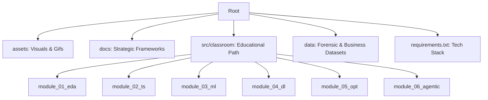

# Data Science for Business Models

### Decision-centric analytics: forecasting, ML, optimization — and the road to autonomy

> Un repositorio práctico que conecta la **estrategia de modelos de negocio** con la **ingeniería de datos**:
> **predicción → valor de decisión → optimización prescriptiva → autonomía**.

---

## 🔗 Quick Navigation

| Módulo | Enfoque Técnico | Impacto Estratégico | Acceso Directo |
| --- | --- | --- | --- |
| **M1** | EDA & Data Quality | Diagnóstico de Salud de Datos | [Ver Módulo](https://www.google.com/search?q=./src/classroom/business_ds/module_01_eda/) |
| **M2** | Time Series & APIs | Forecasting de Demanda y Caja | [Ver Módulo](https://www.google.com/search?q=./src/classroom/business_ds/module_02_ts/) |
| **M3** | ML & Expected Value | Optimización de Rentabilidad | [Ver Módulo](https://www.google.com/search?q=./src/classroom/business_ds/module_03_ml/) |
| **M4** | DL & Causal Inference | Identificación de Drivers Reales | [Ver Módulo](https://www.google.com/search?q=./src/classroom/business_ds/module_04_dl/) |
| **M5** | Prescriptive Opt. | Asignación Eficiente de Recursos | [Ver Módulo](https://www.google.com/search?q=./src/classroom/business_ds/module_05_opt/) |
| **M6** | Agentic AI & Autonomy | Modelos de Negocio Autónomos | [Ver Módulo](https://www.google.com/search?q=./src/classroom/business_ds/module_06_agentic/) |

---

## 🎯 The Vision: From Prediction to Action

Este repositorio no busca solo "entrenar modelos", sino resolver la ecuación económica de la IA:

| Pilar | Concepto Clave | Autor de Referencia |
| --- | --- | --- |
| **Economía de la IA** | La IA reduce el costo de predicción; el valor sube en el **Juicio**. | *Agrawal (Prediction Machines)* |
| **Valor Esperado** | Decisiones basadas en $P(x) \cdot Value(x)$ (Matrices de Confusión Económicas). | *Provost (DS for Business)* |
| **Causalidad** | Diferenciar correlación de causalidad para intervenciones reales. | *Matt Taddy (Business DS)* |
| **Agencia** | El paso del software pasivo a agentes que ejecutan flujos de valor. | *Socio-Economic AI Models* |

---

## 🗺️ Syllabus Detallado e Integrado

### 🛠️ Core Engineering (M1 - M3)

| Tema | Técnica | Aplicación en Negocios |
| --- | --- | --- |
| **Ingeniería de Datos** | ETL, Limpieza, Outliers, Feature Scaling. | Asegurar la integridad del reporte forense/empresarial. |
| **Forecasting** | Estacionalidad, APIs Financieras, Suavizado. | Predicción de ingresos y planificación de inventarios. |
| **ML Supervisado** | XGBoost, Random Forest, Regresión Logística. | Lead Scoring, Churn Prevention y Credit Scoring. |

### 🚀 Advanced Strategy (M4 - M6)

| Tema | Técnica | Aplicación en Negocios |
| --- | --- | --- |
| **Deep Learning** | Backpropagation, CNNs, MLP. | Reconocimiento de patrones en alta dimensionalidad. |
| **Optimización** | Programación Lineal, Simplex, Dualidad. | Maximización de márgenes bajo restricciones de recursos. |
| **IA Agéntica** | Reasoning Loops, Tool-use, Autonomous Agents. | Creación de flujos de trabajo que operan sin intervención humana. |

---

## 🧱 Repository Structure

---

## 🛠️ Tech Stack & Requirements

* **Nivel:** Intermedio - Avanzado.
* **Entorno:** VS Code + Jupyter / Google Colab.
* **Dependencias:** Ejecutar `pip install -r requirements.txt` para configurar el entorno estratégico.

---

## 🤝 Contribuciones y Contacto

Este espacio es una bitácora profesional y pedagógica. Si eres alumno o colega, te invito a explorar los notebooks interactivos.

